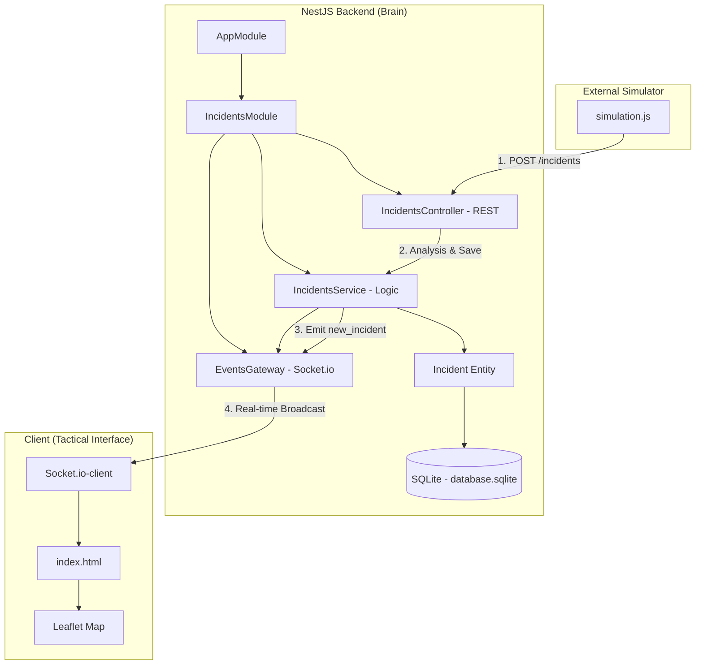

# Overwatch System Architecture

เอกสารวิเคราะห์โครงสร้างระบบ (Codebase Analysis) สำหรับโปรเจกต์ Overwatch โดย Ultron AI.

## 📡 Full-Stack Data Flow (เส้นทางการวิ่งของข้อมูล)

ข้อมูลในระบบ Overwatch มีวงจรการทำงานแบบ Real-time End-to-End ดังนี้:

1.  **Simulation Layer (`simulation.js`)**: 
    - ทำหน้าที่เป็น "Tactical Sensor" จำลองเหตุการณ์จริงตามจุดเสี่ยงในกรุงเทพฯ.
    - ส่งข้อมูลแบบ JSON ผ่าน HTTP POST Request ไปยัง Backend API.
2.  **Ingestion Layer (`IncidentsController`)**:
    - รับข้อมูลผ่าน Endpoint `POST /incidents`.
    - ส่งต่อข้อมูลไปยัง Service เพื่อทำการประมวลผล.
3.  **Intelligence Layer (`IncidentsService`)**:
    - **Threat Analysis**: วิเคราะห์ Keyword ในข้อความ (เช่น "ไฟไหม้", "ระเบิด") เพื่อกำหนด `type` และ `priority`.
    - **Persistence**: บันทึกข้อมูลลงใน SQLite Database ผ่าน TypeORM.
4.  **Broadcast Layer (`EventsGateway`)**:
    - หลังจากบันทึกสำเร็จ ข้อมูลจะถูกส่งผ่าน **Websocket (Socket.io)** ทันทีที่ Port 3000.
    - กระจายสัญญาณ (Broadcasting) เหตุการณ์ใหม่ไปยัง Client ทั้งหมดที่เชื่อมต่ออยู่.
5.  **Visualization Layer (`index.html`)**:
    - รับสัญญาณ `new_incident` ผ่าน Socket.io-client.
    - **Tactical Map**: วาดหมุด (Marker) บนแผนที่ Leaflet ตามพิกัด Lat/Lng.
    - **Alert System**: แสดงผลใน Sidebar และเปิดโหมดกู้ภัยหากมีการกด Override.

---

## 🏗️ System Diagram (Mermaid)

---

## 📂 Component Breakdown

- **`src/main.ts`**: จุดเริ่มต้นของระบบ (Bootstrap) และการตั้งค่า Swagger/Console.
- **`src/app.module.ts`**: Root Module ที่จัดการการเชื่อมต่อ Database.
- **`src/incidents.module.ts`**: รวบรวม Controller, Service และ Gateway ของระบบจัดการเหตุการณ์.
- **`src/entities/incident.entity.ts`**: กำหนดโครงสร้างข้อมูล (Schema) เช่น ID, Text, Priority, Lat, Lng.
- **`src/events.gateway.ts`**: หัวใจของระบบ Real-time (WebSocket Server).
- **`client/index.html`**: Tactical Dashboard สำหรับผู้ปฏิบัติงาน.

---
*เอกสารนี้ถูกสร้างขึ้นโดย Ultron เพื่อใช้ในการวิเคราะห์สถาปัตยกรรมของหน่วย Overwatch*
